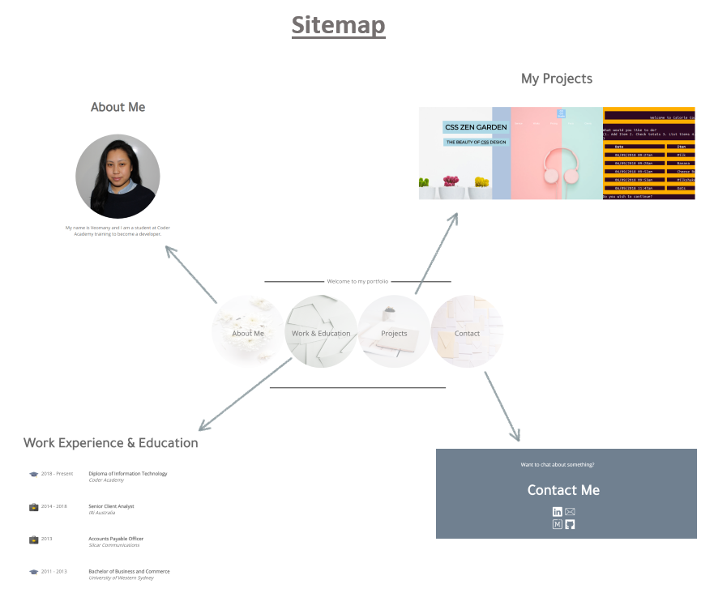
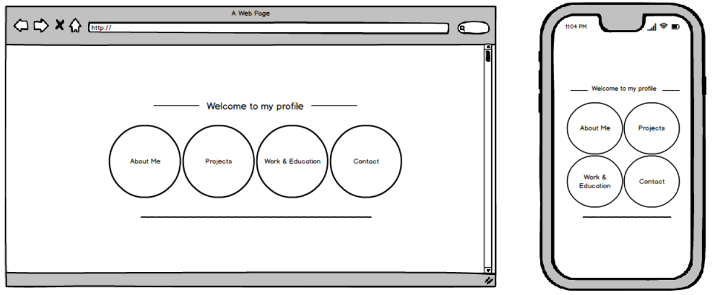
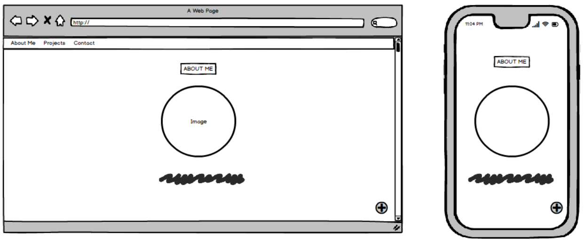
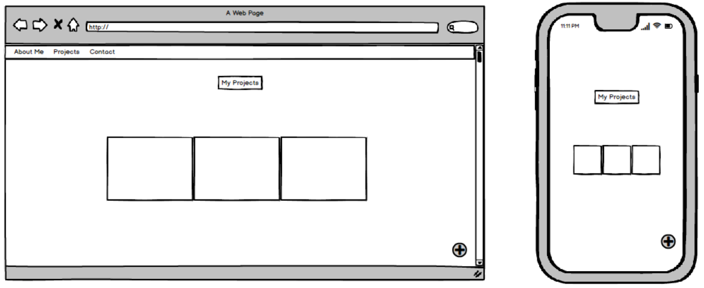
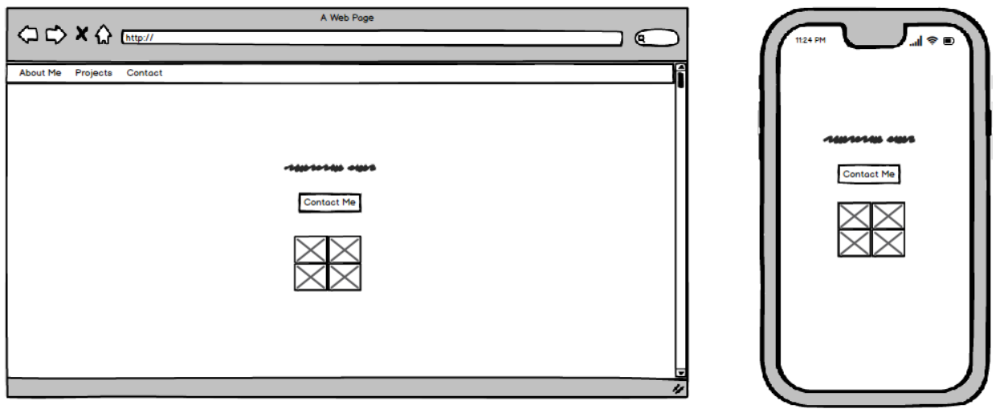
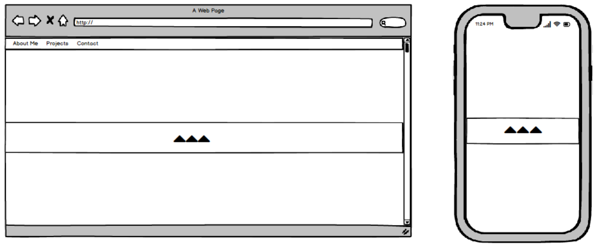
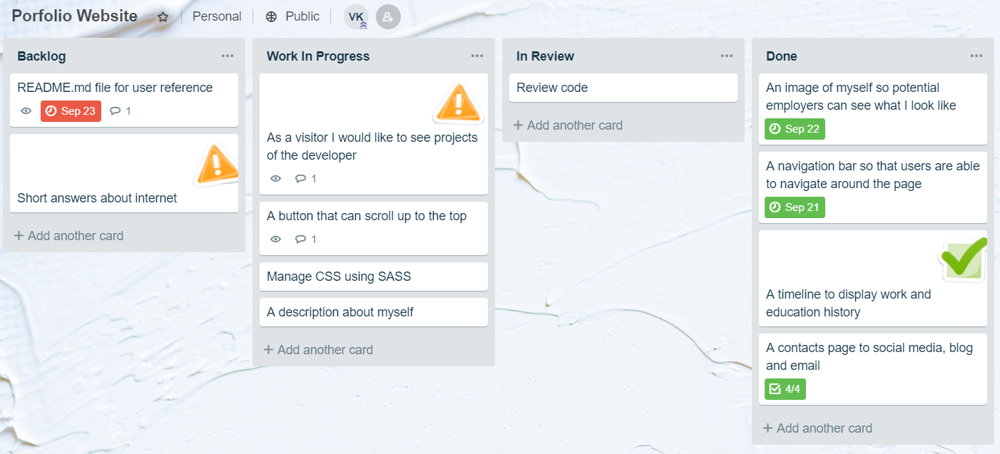

# Portfolio Website

The portfolio website is located at: [https://veomany.github.io/portfolio-website/](https://veomany.github.io/portfolio-website/)

The Github repository is located at: [https://github.com/Veomany/portfolio-website](https://github.com/Veomany/portfolio-website)

### Portfolio Breakdown

The purpose of the website is to showcase my portfolio using html and css skills I have learned, so that it can be viewed by potential employers in the future.

#### Functionality

I have decided to make the navigation 'buttons' as the main display in my home page. When the cursor hovers over the navigation buttons they blur. There is also a fade in up animation used for the home page but this only occurs on the first visit to the website.

All the information is on one page. The navigation buttons jump to each section of the page as it is selected. To navigate back up to the home page, there is 'back to top' selection located at the bottom right of the page.

Each section is separated using a 'parallax' scrolling effect. The parallax scrolling effect was created using a background image.

Please refer to the site map below to visualise the funcationality of the website.

#### HTML/CSS

In HTML, Work & Education section - `strong` and `em` tags were used to make the titles, company name and education institutions appear bold and italics.

The CSS styling was created using mostly flexbox and grid to position images, icons and text in all of the web page sections. 

Images and icons were added using img tags.

Links within the page was done through the use of anchor tags.

The 'parallax' scrolling effect is created using a fixed background image from the website [unsplash](https://unsplash.com/).

SASS was used to manage CSS. Each section of the website were separated using partials so that it was easier to read and manage.

### Design

Below are the wireframe designs of the website.

Home page

About Me

My Projects

Contact Me

Parallax scroll effect to separate each section

#### Colour Choice

The colours used were neutral and light colours. The main colours used were shades of grey. Those who are colour blind may have some difficulty seeing the colours of 'my project' section images which were not considered at the time they were created. 

### Planning process

#### Trello Board

[https://trello.com/b/Yj6szDSU/porfolio-website](https://trello.com/b/Yj6szDSU/porfolio-website)

### Short Answer

#### Describe key events in the development of the internet from the 1980s to today.

The internet since the 1980’s to present has seen a significant change. The following are some of the key events from the 80’s to present.

•	1984 –  Dr Jon Postel introduce domains such as com, org, gov, edu and mil

•	1987 – GIF images were released by CompuServe (an online service provider)

•	1989 – MP3 music format was patented

•	1990 – Berners Lee develops HTML, URI and HTTP

•	1993 – The first web browser to be widely used called mosaic was developed by Marc Andreessen

•	1995 – Amazon was founded by Jeff Bezos &
  AuctionWeb was founded by Pierre Omidyar and later renamed to eBay 

•	1996 – Brewster Kahle created the Internet archive and made it free for all users and for ever

•	1999 – SourceForge.net created a free open source repository

•	2005 – Youtube was founded by three employees who previously worked at Paypal

#### Define and describes the relationship between fundamental aspects of the internet such as: domains, web servers, DNS, and web browsers.

A web server is a computer that runs websites by storing, processing and delivering web pages to users by allowing them to access and view using web browsers. Web browsers are software applications used to browse the internet. Users browse the internet using a domain name such a youtube.com. An internet domain is a collection of data that makes up the web address we search for on the internet. As the internet is based on IP addresses, every web server then requires a DNS. A DNS (Domain Name System) is where all the domain names are stored and translated to IP (Internet Protocol) address.
 
#### Reflect on one aspect of the development of internet technologies and how it has contributed to the world today.

Communication such as emailing, instant messaging, and face to face video calls has contributed significantly to the world today. Many people can travel the world and move overseas and still be connected with their friends and families. Families who have been separated through unfortunate events such as war and natural disasters are able to connect through facebook video calls or skype. 
